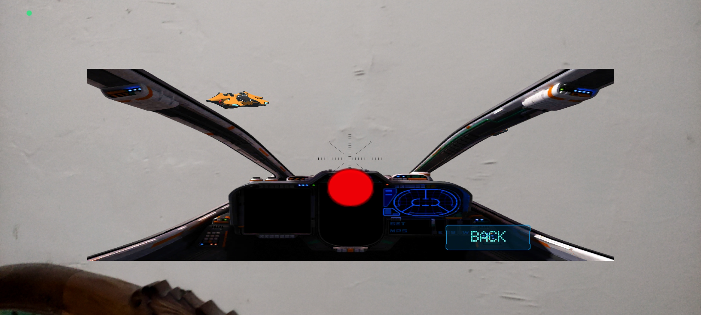
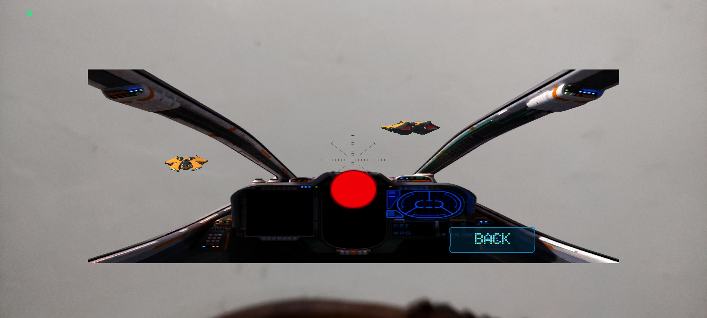
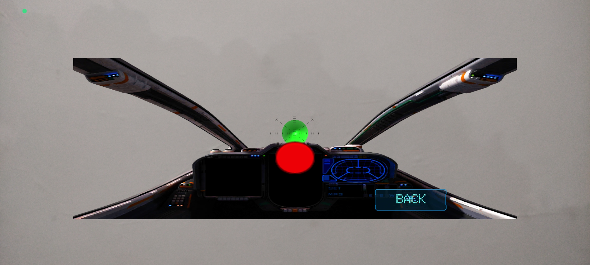
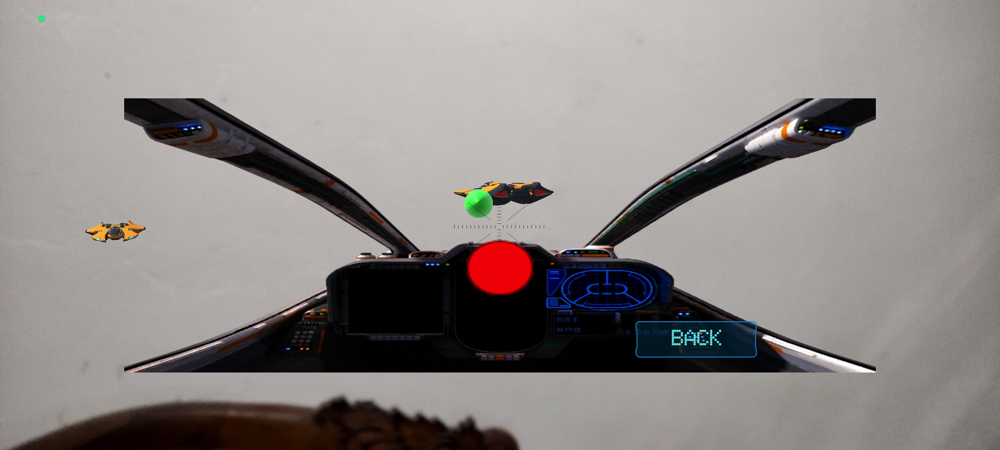
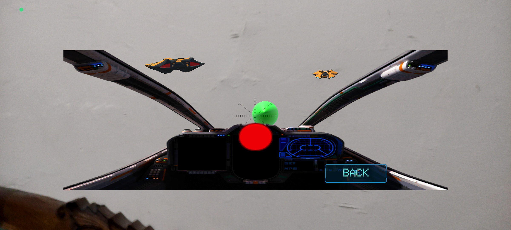

# AR Plane Shooter

Game **Augmented Reality (AR) plane shooter** sederhana yang dikembangkan menggunakan **Unity**. Pemain duduk di kokpit pesawat tempur virtual yang ter-overlay di atas kamera dunia nyata, lalu menembakkan peluru untuk menghancurkan jet-jet musuh yang melayang di sekitar lingkungan sekitar pemain.

Fokus utama gameplay: **arahkan reticle ke target, tunggu lock-on, lalu tembak.**

---

## ✨ Fitur Utama

- **Overlay kokpit AR** — panel kokpit pesawat (HUD, radar, kontrol) ditampilkan di atas feed kamera real-world.
- **Target musuh dinamis** — beberapa jenis jet musuh (jet oranye dan pesawat tipe "kelelawar") muncul dan bergerak melayang di sekitar ruangan.
- **Sistem reticle / lock-on** — crosshair di tengah layar berubah warna sebagai indikator status target:
  - 🔘 **Putih** = belum ada target yang terkunci
  - 🟢 **Hijau** = target sedang terkunci dan siap ditembak
- **Mini radar** — panel radar di kokpit menampilkan posisi relatif musuh di sekitar pesawat.
- **Tombol BACK** — untuk keluar dari sesi gameplay dan kembali ke menu sebelumnya.

---

## 🎮 Cara Bermain

1. Buka aplikasi dan izinkan akses kamera (mode AR).
2. Arahkan/gerakkan device ke sekeliling ruangan — jet musuh akan muncul melayang di udara, seolah berada di dunia nyata.
3. Gerakkan device agar reticle di tengah layar berada tepat di atas target musuh.
4. Tahan posisi reticle pada target hingga indikator berubah dari **putih** menjadi **hijau** (target terkunci).
5. Tembak untuk menghancurkan target sebelum musuh menjauh atau berganti posisi.
6. Tekan tombol **BACK** kapan saja untuk keluar dari sesi permainan.

---

## 🖼️ Screenshot Gameplay

### 1. Target terdeteksi, reticle belum lock-on

*Crosshair masih berwarna putih karena belum tepat mengarah ke target.*

### 2. Dua musuh terdeteksi sekaligus

*Radar di kokpit ikut menampilkan keberadaan musuh di sekitar pemain.*

### 3. Reticle mulai lock-on (berubah hijau)

*Saat reticle diarahkan tepat ke area target, warnanya berubah menjadi hijau sebagai tanda siap tembak.*

### 4. Target terkunci pada jarak dekat

*Lock-on tetap aktif selama reticle berada di atas target, meski posisi musuh berubah.*

### 5. Tampilan kokpit penuh dengan target terkunci

*Tampilan HUD kokpit secara menyeluruh: crosshair, radar, dan tombol BACK.*

---

## 🚧 Rencana Pengembangan (TODO)

- [ ] Tambah variasi jenis pesawat musuh
- [ ] Tambah efek suara tembakan & ledakan
- [ ] Sistem skor & nyawa
- [ ] Level/wave musuh yang semakin sulit

---
